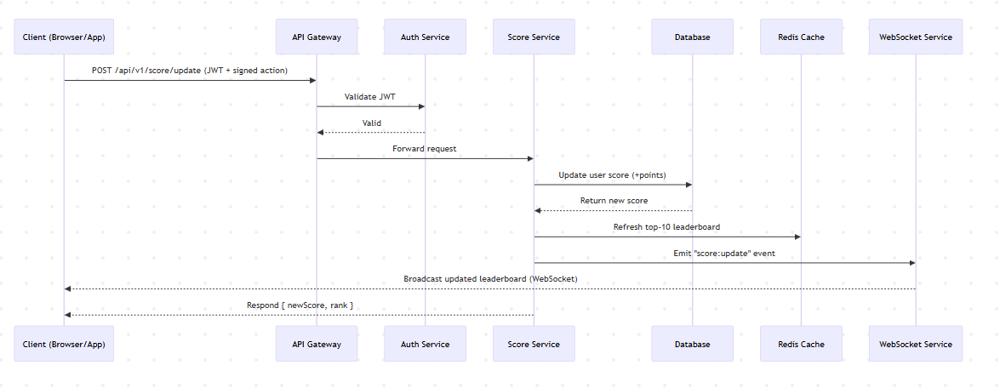

# 1. Overview

This document specifies the backend architecture for a **live scoreboard service** that powers a website showing the **top 10 users’ scores** in real time.
When a user performs a valid in-app action (e.g., wins a match, completes a task), the client dispatches a secure API request to increment their score. The system must update the leaderboard and broadcast the change live to all connected users.

The system must ensure:

- **Security**: No unauthorized or spoofed score updates.
- **Scalability**: Support large concurrent user bases.
- **Consistency**: Scores and leaderboard are always accurate.
- **Real-time Responsiveness**: Sub-second updates visible on the website.

# 2. System architecture

| Component                                             | Description                                                                               |
| ----------------------------------------------------- | ----------------------------------------------------------------------------------------- |
| **Client (Browser / App)**                            | Displays the scoreboard and triggers score updates after valid user actions.              |
| **API Gateway**                                       | Entry point for all HTTP requests. Handles routing, auth verification, and rate limiting. |
| **Score Service (Core Module)**                       | Processes valid score updates, applies business logic, and emits leaderboard updates.     |
| **Auth Service**                                      | Verifies JWT tokens and signs action payloads to prevent forgery.                         |
| **Database**                                          | Stores user profiles, scores, and audit logs.                                             |
| **Cache Layer (Redis)**                               | Maintains top-10 leaderboard in memory for fast retrieval.                                |
| **Message Broker (Kafka / Redis Streams / RabbitMQ)** | Publishes score update events to other services for async processing.                     |
| **Realtime Service (WebSocket / Socket.IO)**          | Pushes live updates to connected clients.                                                 |
| **Monitoring & Logging**                              | Captures system metrics, latency, and suspicious behavior for anti-cheat detection.       |

# 3. Logical Diagram



# 4. API Design

**POST `/api/v1/score/update`**

- Auth: Bearer JWT
- Body:

  ```json
  {
    "actionId": "abc123",
    "points": 100,
    "signature": "HMAC(actionId + points, secret)"
  }
  ```

- Response:

  ```json
  { "newScore": 1200, "rank": 4 }
  ```

**GET `/api/v1/scoreboard/top`**

- Returns cached leaderboard:

  ```json
  [
    { "username": "Alice", "score": 2000 },
    { "username": "Bob", "score": 1800 }
  ]
  ```

**WebSocket Event: `score:update`**

```json
{
  "userId": "xyz",
  "newScore": 1200,
  "leaderboard": [...]
}
```

# 5. Operational Considerations
| Concern           | Approach                                          |
| ----------------- | ------------------------------------------------- |
| **Scalability**   | Horizontal scaling for API, Redis clustering      |
| **Latency**       | Redis caching + async event-driven updates        |
| **Resilience**    | Retry queue on message delivery failure           |
| **Observability** | Use OpenTelemetry / Prometheus for metrics        |
| **Testing**       | Integration tests for event consistency           |
| **CI/CD**         | Docker-based deployment; staging + prod pipelines |

# 6. Suggestions for Future Improvement
1. Add WebSocket authentication (JWT token during handshake).
2. Introduce user ranking microservice (for global rank calculation).
3. Integrate machine learning for cheat detection using anomaly scoring.
4. Add replay verification — allow the game server to verify each user’s in-game proof of action.
5. Multi-region replication for global leaderboard latency optimization.
